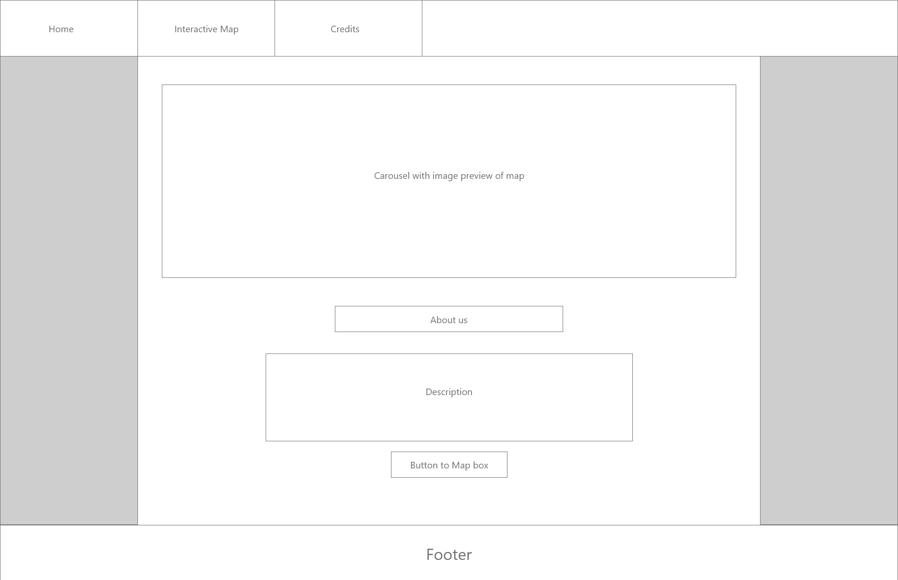
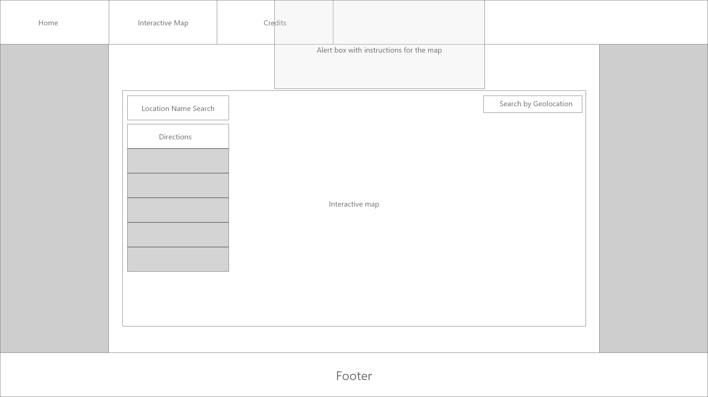
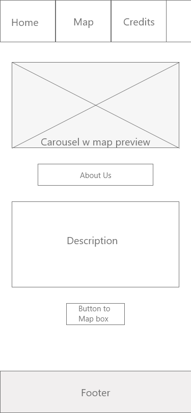
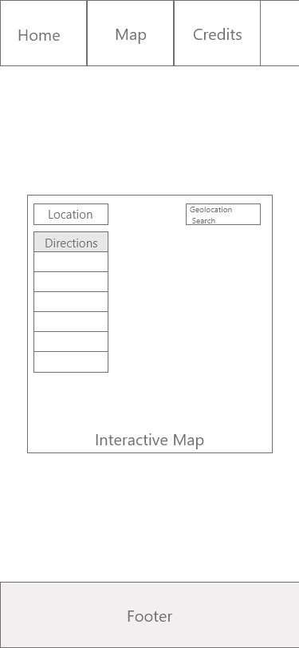
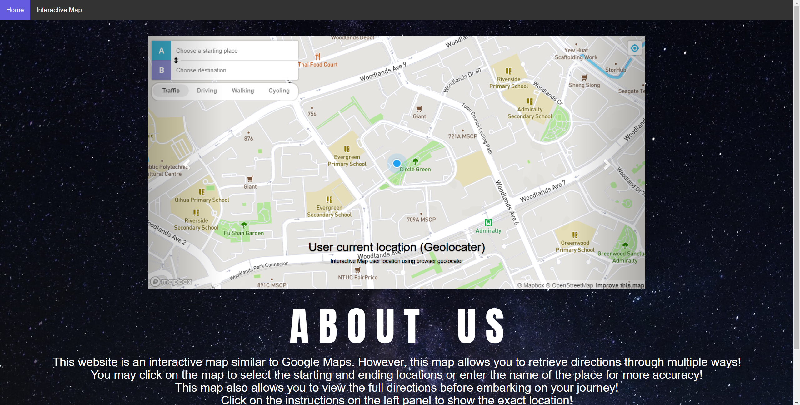
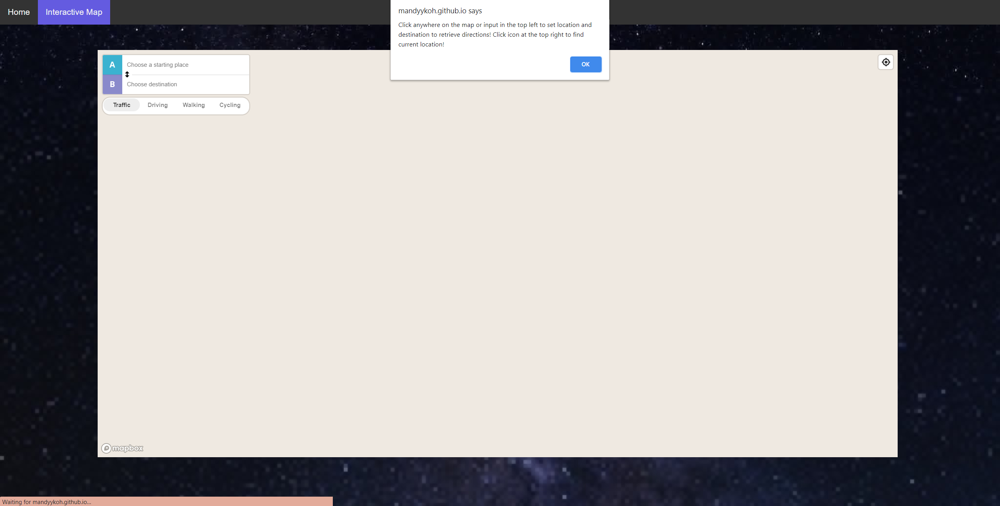
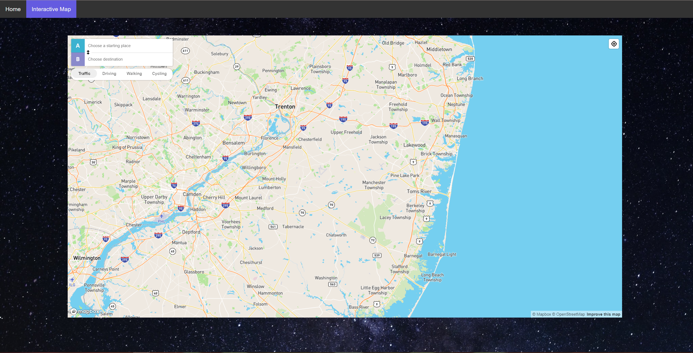

# Assignment 2 - Interactive Map

This project was created to design, develop and implement a dynamic front-end web application using HTML, CSS, JavaScript, jQuery and implement front-end
interactivity, using core JavaScript, JavaScript libraries and/or Application Programming Interfaces (APIs)
Website Link: https://mandyykoh.github.io/Assignment-2/

## Website

This [website](https://mandyykoh.github.io/Assignment-2/) was created in hopes of giving users multiple features in one map. 
What you will be able to do on this site:

- View the world map.
- Learn travelling routes by inputting location names.
    - Travelling routes include:
        - Commonly taken routes (Driving)
        - Route with least traffic (Driving)
        - Route for cyclists
        - Route for walking
- Receive directions by clicking on 2 points of the map.
    - Especially useful if you don't know the name of the area!
- Click on directions to see specific location for change in movement.
- Receive a rough estimate on the time needed to reach the destination.
- Find user's current location on the map.

## Design Process

This simple website was made with the sole purpose of showcasing the interactive map. Therefore, it serves no other purpose other than that. Any external links
found on the site lead to Map Box where the APIs were gathered. It includes a simple homepage with a preview of the map and a short description on the website.
The navigation bar has only 2 options, one leading to the home page and the other to the interactive map. The page with the interactive map only shows the map with
no other information or images so as to allow the users to focus on only the map.

## Features

- Home page
    - Carousel
        - Shows previews of the map so that the user knows what this website is about.
        - Includes captions to explain the features.
    - About Us
        - Explains the website for users.
        - Includes a hyperlink to the interactive map.
        - Includes a button at the bottom linking to Map Box which was used to make the map.
- Interactive Map page
    - Javascript alert box to guide users on the page.
    - GeoLocator popup to retrieve user's current geolocation

## Technologies Used

### Languages

- *[HTML](https://en.wikipedia.org/wiki/HTML#:~:text=Hypertext%20Markup%20Language%20(HTML)%20is,scripting%20languages%20such%20as%20JavaScript.)*
    -HTML was used to create the skeleton of the whole webpage.
- *[CSS](https://en.wikipedia.org/wiki/CSS)*
    -CSS was used to apply designs to the webpage.
- *[JavaScript](https://www.javascript.com/)*
    -Javascript was used to create the alert box and the map

## Wire Frames

## Testing

### Page Preview

- 
- 
- 

### Task List
| No.  |     Feature     |  Date Tested |
|------|:---------------:|-------------:|
| 1    |  Navigation Bar |    31/12     |
| 2    |       Map       |    9/01      |
| 3    |   Map buttons   |    9/01      |
| 4    |    Alert Box    |    9/01      |

## Credits

### Codes (Taken or referenced from)

- Map
    - [Base map](https://docs.mapbox.com/mapbox-gl-js/example/simple-map/)
    - [Driving directions](https://docs.mapbox.com/mapbox-gl-js/example/mapbox-gl-directions/)
    - [User location](https://docs.mapbox.com/mapbox-gl-js/example/locate-user/)
- Bootstrap
    - [Carousel](https://www.w3schools.com/bootstrap/bootstrap_carousel.asp)
- Normalize
    - [Normalize.css](https://necolas.github.io/normalize.css/)

### Media

- ["Clear sky during nighttime"](https://unsplash.com/photos/guvnhd3hbxw?utm_source=unsplash&utm_medium=referral&utm_content=creditShareLink), by [Modern Affliction](https://unsplash.com/@themodernaffliction)

### Acknowledgements

- I received inspiration for this project from: 
    - [OneMap](https://www.onemap.sg/main/v2/)
    - [Google Maps](https://www.google.com.sg/maps)
